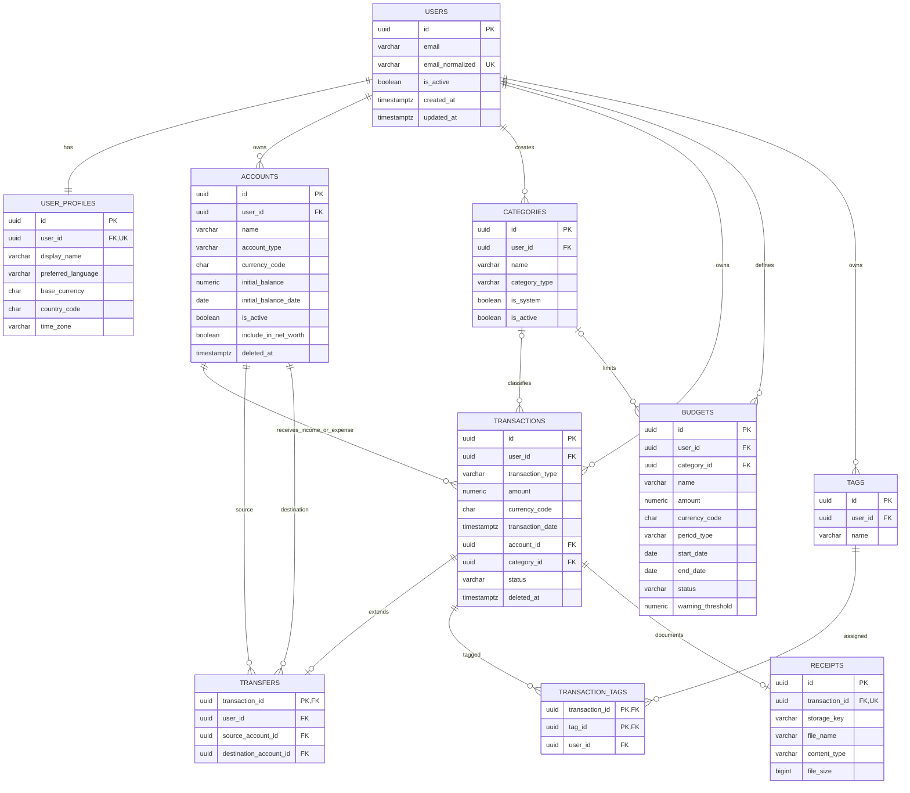

# Diagrama entidad-relación inicial

El diagrama representa el esquema lógico del MVP. Las líneas muestran cardinalidad; los `CHECK`, índices parciales y triggers se documentan fuera del diagrama.

## Nota sobre categorías del sistema

`CATEGORIES.user_id` es nulo únicamente para categorías del sistema. Por eso la relación visual con `USERS` es opcional. Las categorías personales sí tienen exactamente un propietario.
