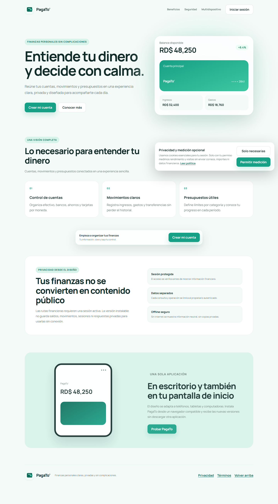
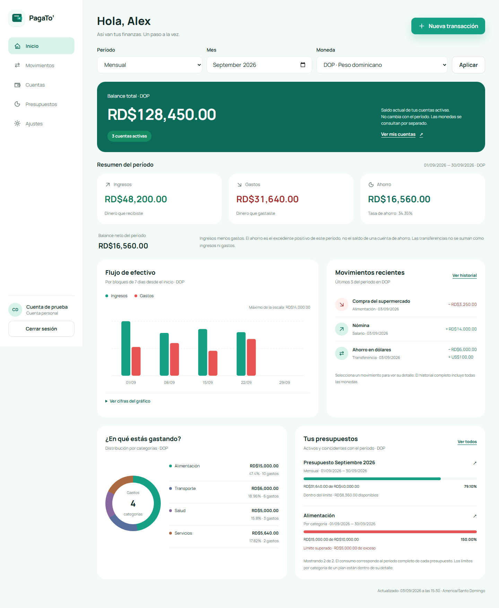
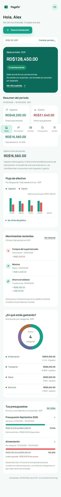

  

<h1 align="center">PagaTo'</h1>

  <strong>Tu dinero, más simple y bajo control.</strong> 
  Organiza cuentas, registra movimientos y crea presupuestos desde cualquier dispositivo.

  <a href="https://pagato.vercel.app"><strong>Usar PagaTo' ahora ↗</strong></a>
  ·
  <a href="#primeros-pasos">Ver cómo empezar</a>

  
  
  

## Una visión clara de tus finanzas

PagaTo' reúne la información que necesitas para entender tu dinero sin depender de hojas de cálculo dispersas. Tus cuentas, ingresos, gastos, transferencias y presupuestos conviven en un espacio privado y fácil de consultar.

Con PagaTo' puedes:

- Conocer tu balance y el flujo de ingresos y gastos del período.
- Registrar movimientos y transferencias entre tus propias cuentas.
- Organizar cada operación con categorías predeterminadas o personales.
- Crear presupuestos mensuales y asignar límites por categoría.
- Copiar la estructura de un presupuesto anterior a un nuevo mes.
- Consultar avances, ahorro proyectado y movimientos recientes.
- Personalizar idioma, moneda, zona horaria, formatos y apariencia.
- Instalar la aplicación en Android, iPhone o computadora.

## Tu panel financiero

El inicio resume lo importante: balance, ingresos, gastos, ahorro, evolución, categorías, presupuestos y actividad reciente. El selector de período te permite observar un mes, un año o un intervalo personalizado sin mezclar monedas distintas.

  

## Pensada para cada pantalla

La navegación cambia de forma natural según el dispositivo. En móvil, las acciones principales permanecen al alcance del pulgar; en escritorio, el espacio se aprovecha para comparar métricas y gráficos con mayor detalle.

  

> Las capturas utilizan información de demostración y no muestran datos financieros reales.

## Primeros pasos

1. Abre [PagaTo' en producción](https://pagato.vercel.app).
2. Selecciona **Crear mi cuenta** y registra tus datos.
3. Agrega tus cuentas: efectivo, banco, ahorro o tarjeta.
4. Revisa las categorías iniciales y crea las que necesites.
5. Registra tus ingresos, gastos o transferencias.
6. Crea un presupuesto mensual y distribuye el límite entre categorías.
7. Regresa a **Inicio** para consultar tu resumen actualizado.

### Cuentas

Cada cuenta mantiene su nombre, tipo, moneda, saldo inicial y estado. Puedes archivarla sin perder el historial y reactivarla cuando la necesites.

### Movimientos

Registra ingresos y gastos con fecha, categoría, método de pago, descripción y notas. Las transferencias actualizan de forma consistente las dos cuentas involucradas y no se cuentan como ingreso ni como gasto.

### Presupuestos

Crea un plan para el mes, define un límite general y distribúyelo entre tus categorías de gasto. PagaTo' calcula lo consumido, lo disponible y el porcentaje usado a medida que registras o corriges movimientos.

### Preferencias

Escoge tema claro, oscuro o automático; español o inglés; moneda principal; zona horaria y formatos de fecha y números. Cambiar la moneda de presentación no altera los importes originales de tus operaciones.

## Instalar PagaTo'

PagaTo' es una aplicación web instalable. No necesitas descargar una aplicación distinta desde una tienda.

**En Android o Chrome:** abre el sitio, utiliza **Instalar aplicación** o elige **Agregar a pantalla de inicio** desde el menú del navegador.

**En iPhone o iPad:** abre el sitio en Safari, pulsa **Compartir** y selecciona **Agregar a pantalla de inicio**.

**En computadora:** abre PagaTo' en Chrome o Edge y selecciona el icono de instalación disponible en la barra de direcciones.

La pantalla sin conexión solo conserva recursos públicos. Para protegerte, las sesiones y la información financiera siempre requieren una conexión segura.

## Privacidad y seguridad

- Tu sesión se verifica antes de mostrar cualquier ruta financiera.
- Cada consulta se limita a los registros del usuario autenticado.
- Las credenciales y cadenas de conexión permanecen en el servidor.
- La aplicación utiliza HTTPS, cookies protegidas y validación de entradas.
- Los datos financieros privados no se almacenan en la caché de la PWA.
- La medición de rendimiento opcional requiere tu consentimiento.

Puedes consultar la [política de privacidad](https://pagato.vercel.app/privacy) y los [términos y condiciones](https://pagato.vercel.app/terms) desde la aplicación.

## Preguntas frecuentes

  
<strong>¿Puedo usar PagaTo' solamente para mí?</strong>

  
Sí. Cada cuenta de usuario tiene un espacio independiente y privado.

  
<strong>¿Puedo usar varias monedas?</strong>

  
Sí. Las cuentas y movimientos conservan su moneda original. El dashboard evita sumar monedas distintas sin una conversión definida.

  
<strong>¿Eliminar una cuenta borra mi historial?</strong>

  
No. Las cuentas, categorías y movimientos utilizan archivo o eliminación lógica cuando corresponde para conservar la trazabilidad.

  
<strong>¿Funciona sin conexión?</strong>

  
La PWA muestra una pantalla informativa y conserva recursos públicos. Los datos financieros y las sesiones no se guardan para uso offline por seguridad.

  <strong>Empieza a ordenar tus finanzas con claridad.</strong>  
  <a href="https://pagato.vercel.app"><strong>Abrir PagaTo' ↗</strong></a>

## Licencia

Todos los derechos permanecen reservados a su autor. El proyecto no publica actualmente una licencia de uso.
