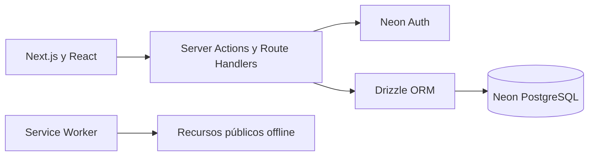

<p align="center">
  
</p>

<h1 align="center">PagaTo'</h1>

<p align="center">
  Finanzas personales claras, privadas y disponibles en cualquier dispositivo.
</p>

<p align="center">
  <a href="https://pagato.vercel.app"><strong>Abrir PagaTo' en producción ↗</strong></a>
</p>

<p align="center">
  
  
  
  
  
</p>

PagaTo' es una aplicación full-stack para organizar cuentas, movimientos y presupuestos personales. Reúne el historial financiero en un dashboard accesible, funciona como PWA instalable y mantiene cada operación asociada al usuario autenticado.

La versión pública se ejecuta en Vercel y utiliza una rama de producción independiente en Neon PostgreSQL.


## Funcionalidades

| Módulo | Capacidades |
| --- | --- |
| Autenticación | Registro, inicio y cierre de sesión, recuperación de contraseña, sesiones y rutas protegidas. |
| Cuentas | Efectivo, bancos, ahorros y tarjetas; saldos, monedas, archivo y reactivación. |
| Categorías | Categorías iniciales y personalizadas para ingresos y gastos. |
| Movimientos | Ingresos, gastos y transferencias; filtros, búsqueda, edición y eliminación lógica. |
| Presupuestos | Planes mensuales, límites por categoría, progreso, ahorro proyectado y copia entre meses. |
| Dashboard | Balance, flujo de efectivo, ahorro, distribución por categorías y movimientos recientes. |
| Preferencias | Tema claro, oscuro o del sistema; idioma, moneda, zona horaria y formatos regionales. |
| PWA | Instalación en escritorio y móvil, actualización controlada y pantalla offline segura. |

## Experiencia multidispositivo

Las pantallas siguen el sistema visual **Mint Flow** definido en la fase de diseño: tipografía Manrope, jerarquía clara, navegación adaptativa y animaciones moderadas con soporte para movimiento reducido.

| Escritorio | Móvil |
| --- | --- |
|  |  |

Las capturas del dashboard utilizan información demostrativa; no contienen datos financieros reales.

## Arquitectura



La aplicación utiliza un monolito modular: frontend y backend viven en el mismo proyecto Next.js, pero cada dominio mantiene separados sus componentes, validaciones, acciones y acceso a datos.

### Tecnologías principales

- Next.js 16 con App Router, React 19 y TypeScript.
- Tailwind CSS y estilos propios basados en Mint Flow.
- Neon PostgreSQL, Neon Auth y Drizzle ORM.
- Zod para validación de entradas.
- Vitest, Testing Library y Playwright.
- Web App Manifest y service worker propio.

## Estructura del repositorio

```text
PagaTo'/
├── Fase 1 Analisis/          # Requerimientos y alcance
├── Fase 2 Diseño/            # Manual gráfico y pantallas Mint Flow
└── Fase 3 Desarrollo/
    ├── app/                   # Aplicación Next.js full-stack
    │   ├── src/app/           # Rutas, layouts y endpoints
    │   ├── src/modules/       # Módulos funcionales
    │   ├── tests/             # Integración, UI y E2E
    │   └── docs/              # Guías técnicas
    └── database/              # Migraciones y documentación PostgreSQL
```

## Desarrollo local

Requisitos: Node.js 24, npm y una rama de Neon destinada a desarrollo.

```powershell
cd "Fase 3 Desarrollo/app"
Copy-Item .env.example .env.local
npm install
npm run dev
```

La aplicación estará disponible en `http://localhost:3000`. Completa `.env.local` con tus credenciales; este archivo está ignorado por Git.

### Variables requeridas

| Variable | Uso |
| --- | --- |
| `DATABASE_URL` | Endpoint pooled de Neon para la aplicación. |
| `DIRECT_URL` | Endpoint directo utilizado exclusivamente para migraciones. |
| `NEON_AUTH_BASE_URL` | URL de Neon Auth para el entorno seleccionado. |
| `NEON_AUTH_COOKIE_SECRET` | Secreto de al menos 32 caracteres para las cookies de autenticación. |
| `APP_URL` | Origen público de la aplicación y callbacks. |
| `SUPPORT_EMAIL` | Correo público de soporte para las páginas legales. |

Nunca se deben versionar credenciales, archivos `.env` reales ni cadenas de conexión.

## Calidad y pruebas

```powershell
npm run check
npm run test:e2e
npm run test:pwa:production
npm run security:check
```

La versión actual cuenta con 228 pruebas unitarias y 80 recorridos E2E en Chromium y WebKit, tanto en escritorio como en móvil. Las suites de integración verifican perfiles, cuentas, categorías, transacciones, concurrencia, presupuestos, dashboard y preferencias contra una rama aislada de Neon.

## Seguridad y privacidad

- Sesión verificada en el servidor y rutas financieras protegidas.
- Consultas parametrizadas, validación estricta y control de propiedad.
- CSP con nonce, cabeceras defensivas, TLS y límites de solicitud.
- Rate limiting, honeypot y respuestas de autenticación no enumerables.
- Caché PWA limitada a cinco recursos públicos; nunca guarda datos financieros o sesiones.
- Escaneo de secretos, auditoría de dependencias y Dependabot en CI.

Consulta la [guía de seguridad](Fase%203%20Desarrollo/app/docs/SEGURIDAD.md) y la [lista de calidad de lanzamiento](Fase%203%20Desarrollo/app/docs/CALIDAD_LANZAMIENTO.md).

## Documentación

- [Aplicación y comandos](Fase%203%20Desarrollo/app/README.md)
- [Dashboard](Fase%203%20Desarrollo/app/docs/DASHBOARD.md)
- [Preferencias](Fase%203%20Desarrollo/app/docs/PREFERENCIAS.md)
- [PWA e instalación](Fase%203%20Desarrollo/app/docs/PWA.md)
- [Animaciones](Fase%203%20Desarrollo/app/docs/ANIMACIONES.md)
- [Base de datos](Fase%203%20Desarrollo/database/README.md)

## Licencia

Este proyecto todavía no publica una licencia de uso. Todos los derechos permanecen reservados a su autor.
