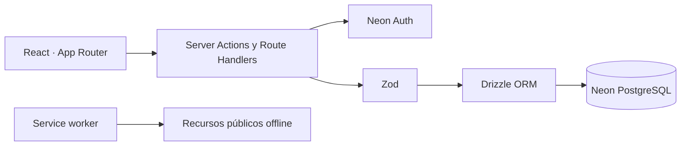

<p align="center">
  
</p>

<h1 align="center">PagaTo' · Guía de desarrollo</h1>

<p align="center">
  Documentación técnica del sistema de finanzas personales PagaTo'.
</p>

<p align="center">
  
  
  
  
  
</p>

> Esta es la documentación de la rama `develop`. La rama `main` contiene la presentación del producto destinada a usuarios y es la única fuente de despliegues de producción.

## Entornos y ramas

| Rama Git | Uso | Vercel | Rama de Neon |
| --- | --- | --- | --- |
| `develop` | Integración y validación | Preview / local | `development` |
| `main` | Versión estable | Production | `production` |

Cada entorno tiene su propia cadena de conexión, Neon Auth y secreto de cookies. No reutilices credenciales de producción en desarrollo ni almacenes archivos `.env` en Git.

## Cómo funciona el sistema

PagaTo' es un monolito modular full-stack. Next.js sirve la interfaz y ejecuta el backend mediante Server Components, Server Actions y Route Handlers. La sesión se valida en el servidor con Neon Auth; Drizzle construye consultas parametrizadas sobre PostgreSQL y cada operación financiera verifica que el registro pertenezca al usuario autenticado.



El service worker solo conserva recursos públicos necesarios para la pantalla sin conexión. Las respuestas privadas, cookies y datos financieros no se guardan en caché.

## Fases del proyecto

```text
PagaTo'/
├── Fase 1 Analisis/          # Alcance, requisitos y reglas del producto
├── Fase 2 Diseño/            # Manual Mint Flow, marca y referencias visuales
└── Fase 3 Desarrollo/        # Implementación técnica, datos, pruebas y operación
```

### Composición de la Fase 3

```text
Fase 3 Desarrollo/
├── app/
│   ├── public/               # Manifest, iconos y recursos PWA
│   ├── scripts/              # Preparación PWA, migraciones y controles de seguridad
│   ├── src/
│   │   ├── app/              # Rutas, layouts, páginas y endpoints de Next.js
│   │   ├── components/       # Componentes compartidos de la aplicación
│   │   ├── lib/              # Configuración y utilidades transversales
│   │   └── modules/          # Dominios funcionales aislados
│   ├── tests/
│   │   ├── integration/      # Comprobaciones contra una rama aislada de Neon
│   │   ├── ui/               # Flujos de interfaz y PWA
│   │   └── e2e/              # Recorridos completos en escritorio y móvil
│   └── docs/                 # Operación, seguridad y decisiones técnicas
└── database/
    ├── migrations/           # Evolución versionada del esquema PostgreSQL
    └── README.md             # Modelo, roles y flujo de migraciones
```

Dentro de `src/modules`, cada dominio separa componentes de interfaz, acciones del servidor, validación y acceso a datos. Los módulos actuales son autenticación, perfiles, cuentas, categorías, transacciones, presupuestos, dashboard, preferencias, PWA y telemetría consentida.

## Frontend y backend

| Capa | Responsabilidad | Ubicación principal |
| --- | --- | --- |
| Frontend | Pantallas responsivas, estados, formularios, navegación y animación | `src/app`, `src/components`, `src/modules/*/components` |
| Backend | Autorización, casos de uso, validación y transacciones de datos | `src/modules/*/server`, `src/app/api` |
| Persistencia | Esquema, consultas y migraciones | `src/db`, `database/migrations` |
| Plataforma | PWA, cabeceras, observabilidad y configuración | `public`, `src/proxy.ts`, `next.config.ts`, `vercel.json` |

La separación es lógica y no requiere dos proyectos desplegables: el servidor nunca expone `DATABASE_URL`, credenciales ni reglas privadas al navegador.

## Tecnologías

- Next.js 16, React 19 y TypeScript.
- Tailwind CSS 4 y estilos semánticos basados en Mint Flow.
- Neon PostgreSQL y Neon Auth.
- Drizzle ORM para acceso tipado a datos.
- Zod para validar entradas y límites.
- Vitest y Testing Library para pruebas unitarias.
- Playwright para pruebas E2E en Chromium y WebKit.
- Web App Manifest y service worker propio para la PWA.

## Preparación local

Requisitos: Node.js 24, npm y acceso a la rama `development` de Neon.

```powershell
cd "Fase 3 Desarrollo/app"
Copy-Item .env.example .env.local
npm install
npm run dev
```

Abre `http://localhost:3000`. `.env.local` debe contener únicamente credenciales de desarrollo:

| Variable | Propósito |
| --- | --- |
| `DATABASE_URL` | Conexión pooled usada por la aplicación. |
| `DIRECT_URL` | Conexión directa usada solo por migraciones. |
| `NEON_AUTH_BASE_URL` | Endpoint de Neon Auth del entorno. |
| `NEON_AUTH_COOKIE_SECRET` | Secreto independiente de al menos 32 caracteres. |
| `APP_URL` | Origen local o público para callbacks. |
| `SUPPORT_EMAIL` | Dirección mostrada en páginas legales. |

## Comandos habituales

```powershell
npm run dev                 # servidor de desarrollo
npm run build               # compilación equivalente a producción
npm run check               # lint, tipos y pruebas unitarias
npm run test:e2e            # recorridos completos responsive
npm run test:pwa:production # manifest, SW y comportamiento instalado
npm run security:check      # secretos y dependencias vulnerables
```

Las suites de integración se ejecutan de forma explícita para no modificar una base compartida:

```powershell
npm run test:db
npm run test:accounts:db
npm run test:categories:db
npm run test:transactions:db
npm run test:transactions:concurrency
npm run test:budgets:db
npm run test:plans:db
npm run test:dashboard:db
npm run test:preferences:db
```

## Datos y migraciones

1. Crea o reinicia una rama aislada de Neon para el cambio.
2. Modifica el esquema tipado y genera la migración con `npm run db:generate`.
3. Revisa el SQL antes de aplicarlo.
4. Ejecuta la migración con la conexión directa: `npm run db:migrate`.
5. Corre las pruebas de integración del dominio afectado.
6. Promueve el cambio primero a `development` y solo después a `production`.

La aplicación usa el endpoint pooled en ejecución y reserva el endpoint directo para herramientas que necesitan una sesión estable. Consulta la [documentación de base de datos](Fase%203%20Desarrollo/database/README.md).

## Flujo de entrega

```text
rama de trabajo → develop → pruebas y Preview → main → Vercel Production
                         Neon development        Neon production
```

- Los cambios funcionales se integran primero en `develop`.
- El conjunto completo debe aprobar lint, tipos, pruebas, compilación y controles de seguridad.
- `main` recibe un merge explícito y representa una versión desplegable.
- Vercel Production sigue únicamente `main`; los previews de `develop` usan Neon `development`.
- Los secretos se administran en Neon y Vercel, nunca en commits o capturas.

## Seguridad

- Autenticación y autorización verificadas en el servidor.
- Propiedad del usuario comprobada en cada consulta financiera.
- Consultas parametrizadas y entradas validadas con Zod.
- Cookies protegidas, CSP con nonce, TLS y cabeceras defensivas.
- Rate limiting, honeypot y respuestas que evitan enumerar cuentas.
- Eliminación lógica y operaciones consistentes para transferencias.
- Dependabot, auditoría de paquetes y escaneo de secretos.

## Documentación técnica

- [Aplicación y módulos](Fase%203%20Desarrollo/app/README.md)
- [Arquitectura del dashboard](Fase%203%20Desarrollo/app/docs/DASHBOARD.md)
- [Preferencias y formatos](Fase%203%20Desarrollo/app/docs/PREFERENCIAS.md)
- [PWA e instalación](Fase%203%20Desarrollo/app/docs/PWA.md)
- [Seguridad](Fase%203%20Desarrollo/app/docs/SEGURIDAD.md)
- [Calidad de lanzamiento](Fase%203%20Desarrollo/app/docs/CALIDAD_LANZAMIENTO.md)
- [Base de datos](Fase%203%20Desarrollo/database/README.md)

## Licencia

El proyecto no publica todavía una licencia de uso. Todos los derechos permanecen reservados a su autor.
